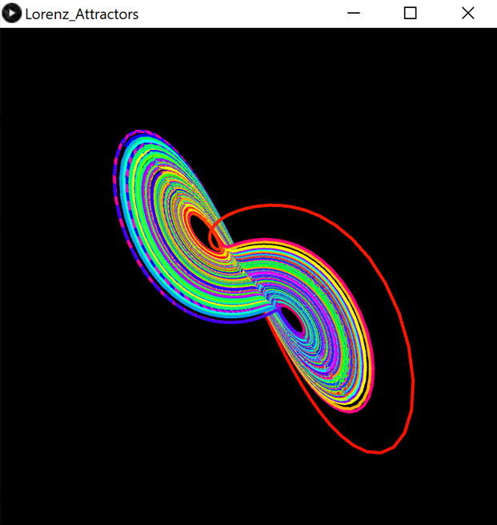
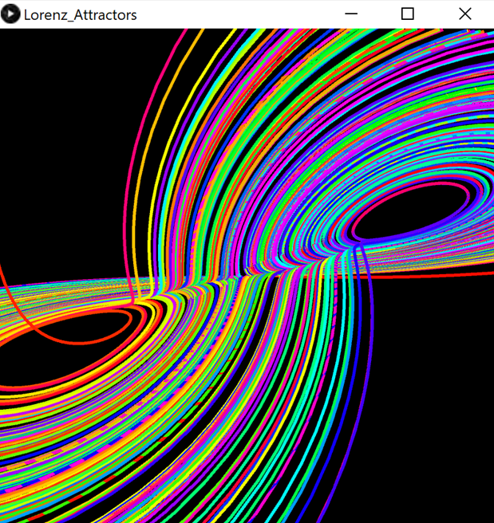

# Lorenz Attractors

## Table of Contents
- [Lorenz Attractors](#lorenz-attractors)
  - [Table of Contents](#table-of-contents)
  - [Description](#description)
      - [Programming language(s):](#programming-languages)
    - [Display](#display)
      - [Examples](#examples)
    - [Folder structure](#folder-structure)
  - [Installation](#installation)
  - [Usage](#usage)
    - [Invokation](#invokation)
    - [Operation](#operation)
  - [Contributions](#contributions)

## Description
This program creates a visual demonstration/animation of Lorenz systems.  
Start date: October 31, 2020  
Current version: 0.1.0  
#### Programming language(s):
- Processing (Java)
	- [Lorenz_Attractors.pde](Lorenz_Attractors.pde)&mdash;main program entrance sets up canvas and executes animation steps

### Display
#### Examples

### Folder structure
| Tree with Root Having Local Path | Generation Method | Description |
| -------------------------------- | ----------------- | ----------- |
| [https://github.com/anderjef/Lorenz_Attractors](https://github.com/anderjef/Lorenz_Attractors) | auto-generated by Processing | <!-- --> |
| [.github/](.github/) | <!-- --> | holds GitHub-specific documents |

## Installation
- Download [ZIP](https://github.com/anderjef/Lorenz_Attractors/archive/Lorenz_Attractors.zip). Extract to a folder named Lorenz_Attractors.
- Download and install [Processing 3 or compatible](https://processing.org/). Please understand that Processing may have bugs of its own.
- Open any of the Processing Source Code files with the Processing IDE (PDE).
- Install the PeasyCam library (within the Processing environment).

## Usage
### Invokation
- See [Installation](#installation).
- Run the code from within the Processing IDE or export the application first.

### Operation
Click and drag the display to rotate the camera. Scroll to zoom.

## Contributions
- Jeffrey Andersen&mdash;developer
- [YouTube The Coding Train Video](https://www.youtube.com/watch?v=f0lkz2gSsIk)&mdash;inspiration

For copyright, license, and warranty, see [LICENSE.md](LICENSE.md).